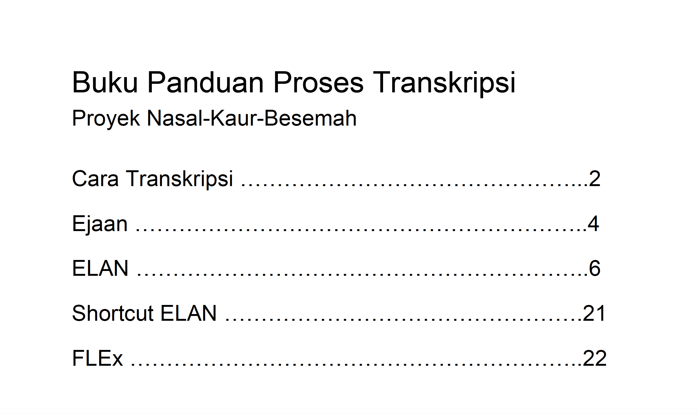

background-image: url(img/nsy-training.jpg)
background-size: cover
class: right, top

# Nasal, Kaur, Besemah training

---
background-image: url(img/besemah-nasal.png)
background-size: cover
class: right, bottom

# Two speech communities, two projects, one training


---
# Two speech communities, two projects, one training


```{r out.width='80%', fig.height=6.5, eval=require('leaflet'), echo=FALSE}
library(leaflet)
leaflet() %>% 
  addTiles() %>% 
  addProviderTiles(providers$CartoDB.Positron) %>%
  addMarkers(
    c(103.1985902, 103.502353), 
    c(-3.9577382, -4.870747),
    label = c("Besemah", "Nasal"), 
    labelOptions = labelOptions(noHide = T, 
                                textsize = "15px")
    ) %>%
  
  setView(103.5, -3.5, zoom = 7) %>%
  addMiniMap(position = "bottomleft",
             zoomLevelOffset = -5,
             tiles = providers$CartoDB.Positron, 
             width = 125, 
             height = 125) # %>%
  #   addPopups(103.1985902,-3.9577382, "Besemah",
  #  options = popupOptions(closeButton = FALSE)
  # )
```

---
# Goals of the training

  1. Learn UCSB-style Discourse Transciption
  1. Learn ELAN
  1. Learn basic glossing in FLEx

---
# Activities

  1. Learn a little, use it a lot.
  1. Taught a little bit, then they practiced right away.
  1. Provided lots of feedback early on
  1. Provided activities to practice certain tasks that they'll be doing.
  
---
class: inverse

# Created an instruction manual



---
# Where do we go from here?

  1. They've gone back to their villages and will begin transcribing and tranlsating recordings
  1. We'll visit again in June/July to collect more data and check on their progress.

---
class: middle, center, inverse

# What could you do?


